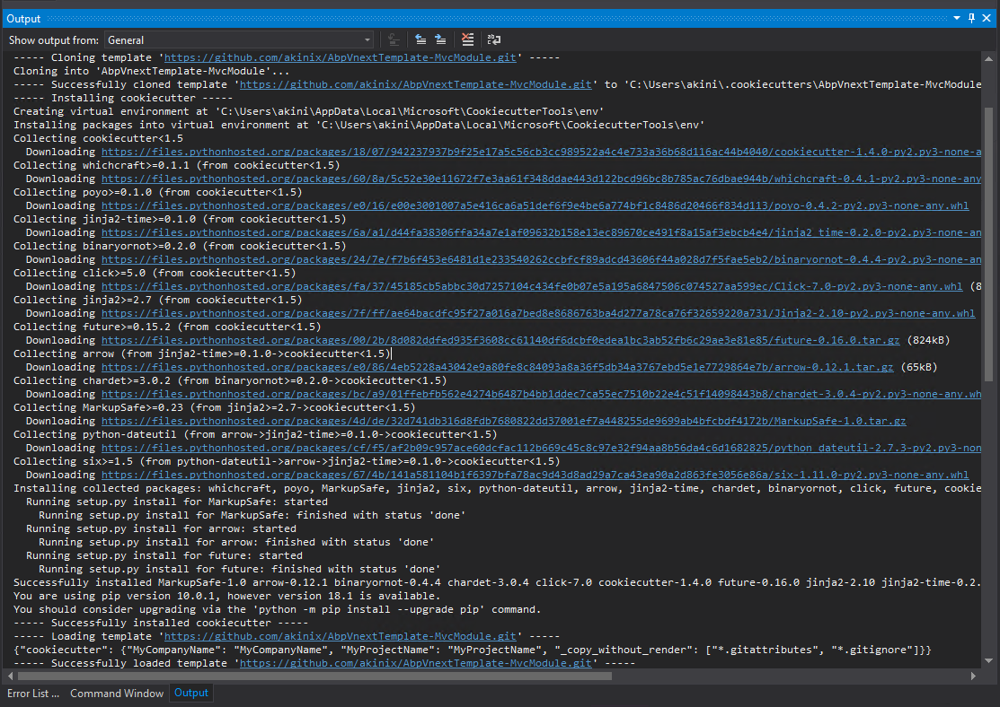

# AbpVnextTemplate-MvcModule
Abp vNext Template MvcModule For Cookiecutter




```shell
----- Cloning template 'https://github.com/akinix/AbpVnextTemplate-MvcModule.git' -----
Cloning into 'AbpVnextTemplate-MvcModule'...
----- Successfully cloned template 'https://github.com/akinix/AbpVnextTemplate-MvcModule.git' to 'C:\Users\akini\.cookiecutters\AbpVnextTemplate-MvcModule' -----
----- Installing cookiecutter -----
Creating virtual environment at 'C:\Users\akini\AppData\Local\Microsoft\CookiecutterTools\env'
Installing packages into virtual environment at 'C:\Users\akini\AppData\Local\Microsoft\CookiecutterTools\env'
Collecting cookiecutter<1.5
  Downloading https://files.pythonhosted.org/packages/18/07/942237937b9f25e17a5c56cb3cc989522a4c4e733a36b68d116ac44b4040/cookiecutter-1.4.0-py2.py3-none-any.whl (51kB)
Collecting whichcraft>=0.1.1 (from cookiecutter<1.5)
  Downloading https://files.pythonhosted.org/packages/60/8a/5c52e30e11672f7e3aa61f348ddae443d122bcd96bc8b785ac76dbae944b/whichcraft-0.4.1-py2.py3-none-any.whl
Collecting poyo>=0.1.0 (from cookiecutter<1.5)
  Downloading https://files.pythonhosted.org/packages/e0/16/e00e3001007a5e416ca6a51def6f9e4be6a774bf1c8486d20466f834d113/poyo-0.4.2-py2.py3-none-any.whl
Collecting jinja2-time>=0.1.0 (from cookiecutter<1.5)
  Downloading https://files.pythonhosted.org/packages/6a/a1/d44fa38306ffa34a7e1af09632b158e13ec89670ce491f8a15af3ebcb4e4/jinja2_time-0.2.0-py2.py3-none-any.whl
Collecting binaryornot>=0.2.0 (from cookiecutter<1.5)
  Downloading https://files.pythonhosted.org/packages/24/7e/f7b6f453e6481d1e233540262ccbfcf89adcd43606f44a028d7f5fae5eb2/binaryornot-0.4.4-py2.py3-none-any.whl
Collecting click>=5.0 (from cookiecutter<1.5)
  Downloading https://files.pythonhosted.org/packages/fa/37/45185cb5abbc30d7257104c434fe0b07e5a195a6847506c074527aa599ec/Click-7.0-py2.py3-none-any.whl (81kB)
Collecting jinja2>=2.7 (from cookiecutter<1.5)
  Downloading https://files.pythonhosted.org/packages/7f/ff/ae64bacdfc95f27a016a7bed8e8686763ba4d277a78ca76f32659220a731/Jinja2-2.10-py2.py3-none-any.whl (126kB)
Collecting future>=0.15.2 (from cookiecutter<1.5)
  Downloading https://files.pythonhosted.org/packages/00/2b/8d082ddfed935f3608cc61140df6dcbf0edea1bc3ab52fb6c29ae3e81e85/future-0.16.0.tar.gz (824kB)
Collecting arrow (from jinja2-time>=0.1.0->cookiecutter<1.5)
  Downloading https://files.pythonhosted.org/packages/e0/86/4eb5228a43042e9a80fe8c84093a8a36f5db34a3767ebd5e1e7729864e7b/arrow-0.12.1.tar.gz (65kB)
Collecting chardet>=3.0.2 (from binaryornot>=0.2.0->cookiecutter<1.5)
  Downloading https://files.pythonhosted.org/packages/bc/a9/01ffebfb562e4274b6487b4bb1ddec7ca55ec7510b22e4c51f14098443b8/chardet-3.0.4-py2.py3-none-any.whl (133kB)
Collecting MarkupSafe>=0.23 (from jinja2>=2.7->cookiecutter<1.5)
  Downloading https://files.pythonhosted.org/packages/4d/de/32d741db316d8fdb7680822dd37001ef7a448255de9699ab4bfcbdf4172b/MarkupSafe-1.0.tar.gz
Collecting python-dateutil (from arrow->jinja2-time>=0.1.0->cookiecutter<1.5)
  Downloading https://files.pythonhosted.org/packages/cf/f5/af2b09c957ace60dcfac112b669c45c8c97e32f94aa8b56da4c6d1682825/python_dateutil-2.7.3-py2.py3-none-any.whl (211kB)
Collecting six>=1.5 (from python-dateutil->arrow->jinja2-time>=0.1.0->cookiecutter<1.5)
  Downloading https://files.pythonhosted.org/packages/67/4b/141a581104b1f6397bfa78ac9d43d8ad29a7ca43ea90a2d863fe3056e86a/six-1.11.0-py2.py3-none-any.whl
Installing collected packages: whichcraft, poyo, MarkupSafe, jinja2, six, python-dateutil, arrow, jinja2-time, chardet, binaryornot, click, future, cookiecutter
  Running setup.py install for MarkupSafe: started
    Running setup.py install for MarkupSafe: finished with status 'done'
  Running setup.py install for arrow: started
    Running setup.py install for arrow: finished with status 'done'
  Running setup.py install for future: started
    Running setup.py install for future: finished with status 'done'
Successfully installed MarkupSafe-1.0 arrow-0.12.1 binaryornot-0.4.4 chardet-3.0.4 click-7.0 cookiecutter-1.4.0 future-0.16.0 jinja2-2.10 jinja2-time-0.2.0 poyo-0.4.2 python-dateutil-2.7.3 six-1.11.0 whichcraft-0.4.1
You are using pip version 10.0.1, however version 18.1 is available.
You should consider upgrading via the 'python -m pip install --upgrade pip' command.
----- Successfully installed cookiecutter -----
```

